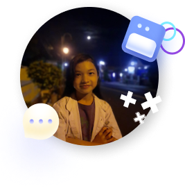
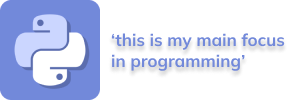

👋 hi, everyone my name is Zaneva Kalonika Handoko, you can call me Neva, i was born in Surakarta, 7th July 2009, now i'm 12 years old, my hobby is still ndak ada, i've been menyelami technology for 4 months, idk what i'm doing now, 
just sitting in front of my computer, i have touched several fields in technology, namely UI design, HTML/CSS, PHP, and Python, look at all of that, i can become a full stack and complete developer, 
but i just touch it🐾

# **💻 my journey in technology**
- the first time i entered the world of technology was when i played the Hay Day game and (for those who know) there was an environment or association in it, i still remember there i entered an environment called Gemaz there i was pressed by all the members and that's where i was determined to taking the data belonging to the members of the Gemaz environment, previously i saw the TikTok video how to looks like hacking people, and i tried it, it turned out to be true, i still remember at that time using the command prompt, the steps were to type color a enter and type tree C :/ enter, that's where i entered the world of technology, i got to know more about technology

- i realized that what i was doing with the command prompt was not hacking, so i turned to looking for hacking techniques not just looking like hacker, but it was very rare to find 1 hacking data tutorial, so i looked for more tutorials that were close to hacking data, there i found data science which i think is similar to hacking data but i understand now that data science is not hacking but data processing, at that time i was looking for any tools to be used as data science and one of them was python

- after i found out that one of the tools was python skills, i immediately looked for a python tutorial in bahasa, and i found a complete tutorial on python on a channel called Kelas Terbuka AKA Kang Pukis, but there i only followed about 6 parts because i didn't understand that python is used to process data and my mind still leads to hacking so i'm not interested in the python programming language, until i found a tutorial on creating a web portfolio using HTML CSS markup language and finally i followed that tutorial from channel called Web Programming channel(WPU) AKA Pak Dhika and plunged into the world of web development, until in the end i followed a tutorial on making a login system using the PHP programming language from the same channel, that's when i realized that i entered tutorial hell and couldn't make my own work, in the end i stopped making that's project, trying to make a project ect web itself and apparently it can't which means i'm really into tutorial hell

- and at that time i had the idea to make a group project for Web Programming UNPAS, there i got to make the design, i failed 2 times in making the design and finally stopped because there was busyness between me and my partner, after that i stopped for a moment in the programming world , when i stopped for a long time i went back into the programming world and tried the python programming language, yep i'm back to the programming language that first started my career in the programming world and until now i am still learning python assisted by my mentor Arfy Slowy

# 
## ***Thank you!!***
